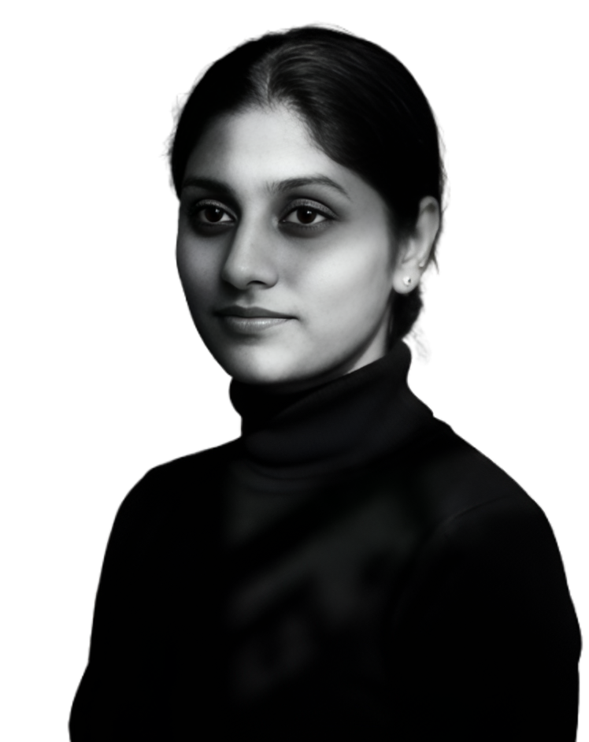

<div align="center">

[](https://git.io/typing-svg)



### Developer Portfolio

A clean, responsive portfolio with a light editorial layout and a lavender accent. It shows my backend projects with architecture diagrams, my experience, education and how to reach me.

<br>

[](https://nehavardhinijk-portfolio.vercel.app/)
[](https://github.com/jk-neha)
[](https://www.linkedin.com/in/nehavardhinijk)

</div>

<!--
Add a screenshot of the live site at screenshots/home.png, then remove this comment:

<p align="center"></p>
-->

---

## 📖 About

This is the source code for my personal portfolio. I'm a Python backend developer working with FastAPI, Django REST Framework and PostgreSQL, and this site collects the projects I've built and deployed.

## 🚀 What's on the site

- **Hero** with my role, a short intro and a resume download
- **Core tech stack**: Python, FastAPI, Django REST Framework, PostgreSQL, REST APIs and JWT
- **Featured projects** with an architecture diagram and a Challenge / Solution / Result summary: CareBridge and Campus Intelligence System
- **More projects**: Full Stack Product App, PDF AI Chatbot, FaceID Attendance and PolluCast
- **Experience timeline** plus education, certifications and research papers
- **Contact section** with links to LinkedIn, GitHub and email
- Fully responsive, with keyboard focus styles and reduced-motion support

## 🛠 Tech stack

<div align="center">


</div>

## 📂 Project structure

```text
public
├── projects            project images
├── photo.jpg           hero portrait
└── Neha Vardhini J K Resume.pdf
src
├── App.jsx             page sections and layout
├── data.js             all the content (projects, experience, education)
├── index.css           styles and colour tokens
└── main.jsx
```

## ✏️ Updating the content

All the text lives in `src/data.js`. To add a project, copy an entry in `featured` or `moreProjects`. To change colours, edit the tokens at the top of `src/index.css`.

## ⚙ Run locally

```bash
git clone https://github.com/jk-neha/nehavardhinijk-portfolio.git
cd nehavardhinijk-portfolio
npm install
npm run dev
```

Build for production:

```bash
npm run build
```

## 🌐 Deployment

The site is deployed on Vercel and redeploys automatically on every push to `main`.

Live: https://nehavardhinijk-portfolio.vercel.app/

## 👩🏻‍💻 Author

**Neha Vardhini J K**, Python Backend Developer, Chennai, India

- LinkedIn: https://www.linkedin.com/in/nehavardhinijk
- GitHub: https://github.com/jk-neha

---

<div align="center">

If you like this portfolio, consider giving it a ⭐

</div>

