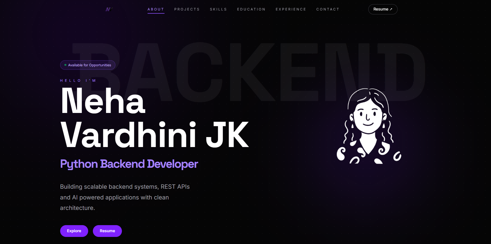
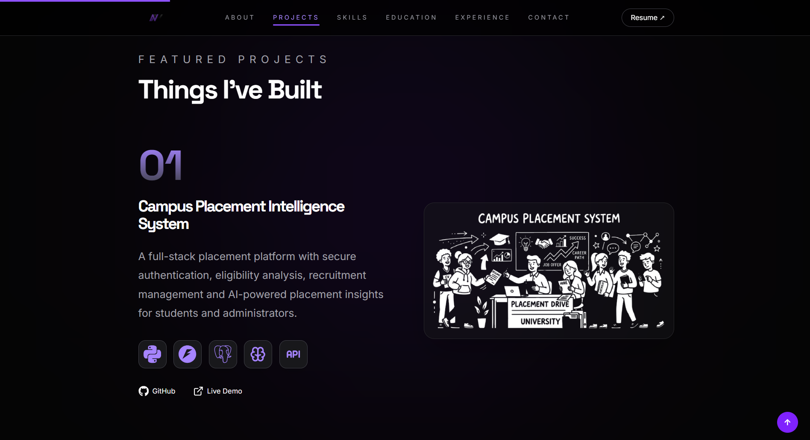
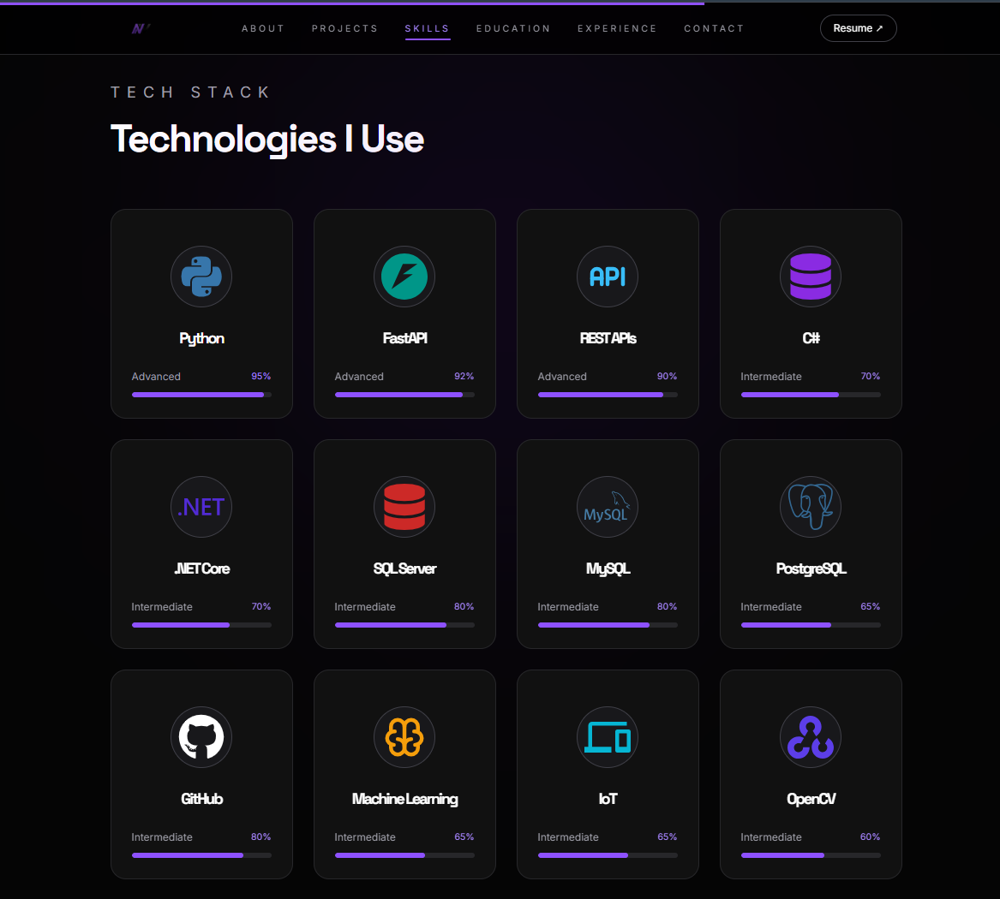
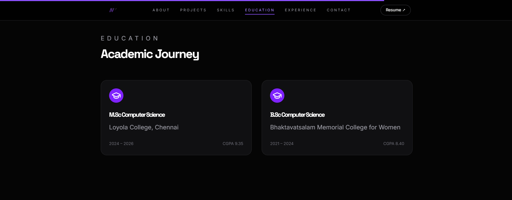
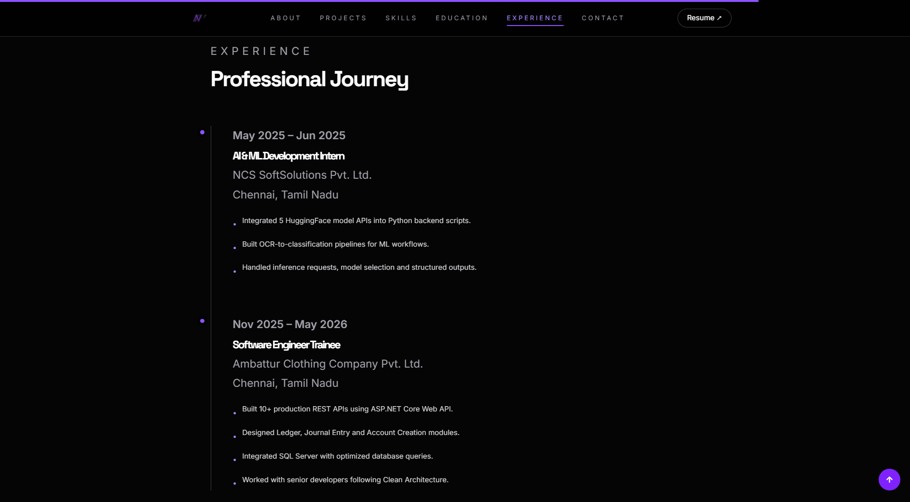
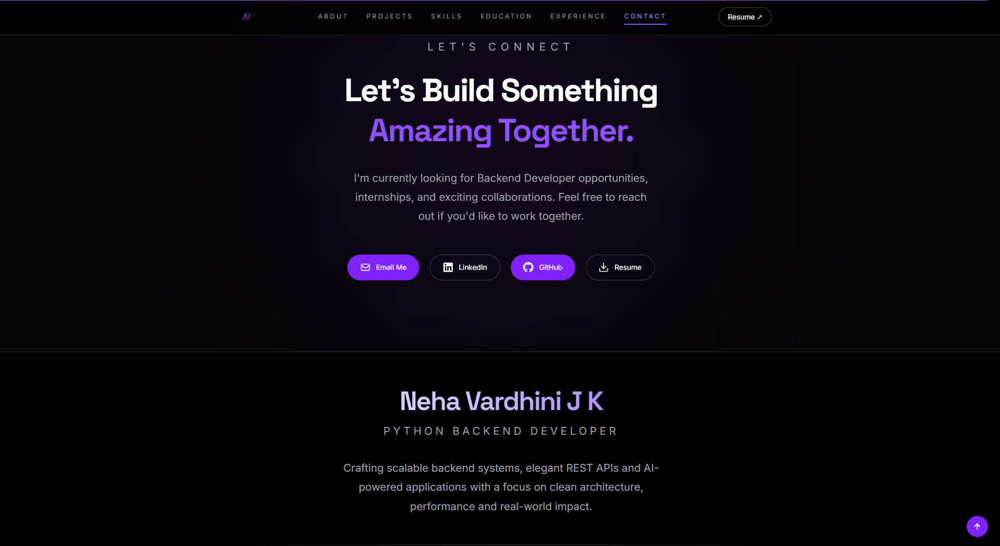

<div align="center">

[](https://git.io/typing-svg)

<p align="center">



### Modern Developer Portfolio

A clean, responsive and animated personal portfolio showcasing my projects, technical skills, education, experience and backend development journey.

<br>

[](https://nehavardhinijk-portfolio.vercel.app/)
[](https://github.com/jk-neha)
[](https://linkedin.com/in/nehavardhinijk)

</div>

---
# 📖 About

This repository contains the source code for my personal developer portfolio.

The portfolio showcases my projects, technical skills, education, professional experience, and backend development journey through a modern and responsive user interface.

It is designed with smooth animations, clean typography, reusable components, and a scalable React architecture.

---

# 🚀 Features

- ✨ Modern UI with glassmorphism
- 🎨 Fully responsive layout
- ⚡ Smooth Framer Motion animations
- 💻 Interactive Tech Stack section
- 📂 Featured Projects showcase
- 🎓 Education Timeline
- 💼 Experience Timeline
- 📞 Contact section
- 📄 Resume Download
- 🌙 Professional Dark Theme
- ⌨️ Typing Animation
- 🔝 Scroll Progress Indicator
- 📱 Mobile Friendly

---

# 🛠 Tech Stack

<div align="center">

### Frontend


### Tools


</div>

---

# 📂 Project Structure

```text
src
│
├── components
├── sections
├── data
├── assets
│
public
│
├── projects
├── tech
│
App.jsx
main.jsx
```

---

# ⚙ Installation

Clone the repository

```bash
git clone https://github.com/jk-neha/nehavardhinijk-portfolio.git
```

Move into the project

```bash
cd nehavardhinijk-portfolio
```

Install dependencies

```bash
npm install
```

Run locally

```bash
npm run dev
```

Build for production

```bash
npm run build
```

---

# 🌐 Live Demo

### 🚀 Portfolio Website

https://nehavardhinijk-portfolio.vercel.app/

# 📸 Screenshots

## 🏠 Home


---

## 💼 Projects



---

## 🧠 Skills



---

## 🎓 Education



---

## 💻 Experience



---

## 📞 Contact



---

# 👩🏻‍💻 Author

## Neha Vardhini J K

Python Backend Developer

📍 Chennai, India

- LinkedIn → https://linkedin.com/in/nehavardhinijk
- GitHub → https://github.com/jk-neha

---

<div align="center">

### ⭐ If you like this portfolio, consider giving it a star!

Made with ❤️ using React, Tailwind CSS & Framer Motion

</div>
